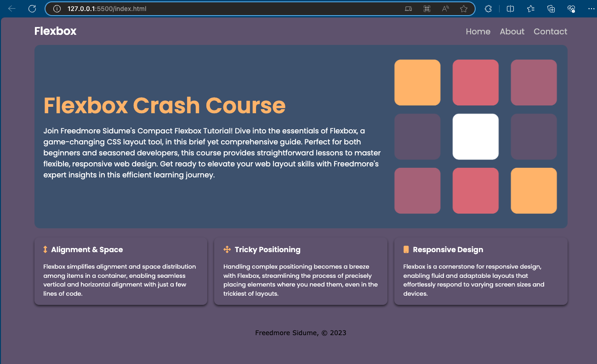

# CSS Flexbox Crash Course

I did a comprehensive crash course in CSS Flexbox.

## Technologies Used

- **HTML5**: Semantic HTML structure for clear, readable, and accessible markup.
- **CSS3**: Advanced CSS features, particularly focusing on Flexbox for layout management.
- **Google Fonts**: Used for typography enhancement.
- **Font Awesome**: Integrated for adding icons to enrich the UI design.

## Skills Demonstrated

- **HTML5 Semantic Elements**: Demonstrates the use of modern HTML5 tags to structure web content meaningfully.
- **CSS Flexbox**: Showcases the ability to create complex layouts with CSS Flexbox, emphasizing alignment, spacing, and responsive design.
- **Responsive Design**: Utilizes media queries to ensure the website's layout adapts to different screen sizes, enhancing the site's mobile-friendliness.
- **External Libraries**: Incorporates external resources like Google Fonts and Font Awesome to enhance the design and user experience.

## Visuals

## Acknowledgment

Many thanks to [Traversy Media](https://youtu.be/3YW65K6LcIA?si=1LcrKX8ErJ08Y_2g)

